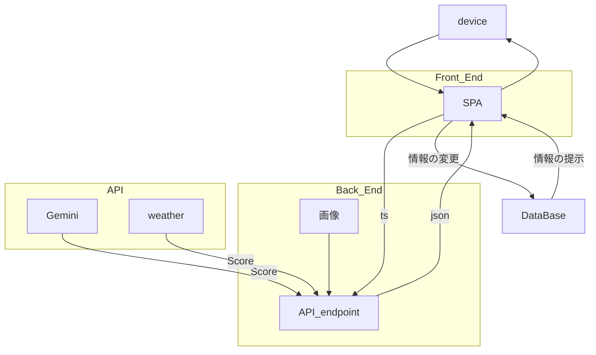

## 1. 背景
-----
現代社会において、私たちは常に膨大な情報と選択肢に晒されています。人は1日に最大で数万回もの決断を繰り返していると言われており、この絶え間ない選択の蓄積は人々のストレスの要因となっています。

情報のデジタル化が進んだことでやるべきことを記録し、整理することは容易になりました。しかし、記録された膨大なタスクの中から今、この瞬間に何を選択すべきかを決め続けるプロセスは、依然として個人の脳内処理に依存しています。

この判断にかかる高負荷なコストが、本来最も集中すべき実行のためのエネルギーを削り取っており、結果として先延ばしや現状維持といった非効率な選択を誘発してしまう状況があります。

## 2. 課題
-----
### 2-1. 実行の判断をユーザーに丸投げしている構造
従来のToDoリストは記録には長けていますが、実行の段階で「どの順序で着手すべきか」という判断をユーザーに委ねています。リストが長大化するほど、実行時に「選び出す」という作業が新たなストレスを生み、書き出すことで得た安心感が、いざ動く時の心理的障壁へと変わってしまいます。

### 2-2. タスクと「外的要因」の断絶
多くのツールはタスクを静的な文字情報として扱うため、急な天候の変化や予定の延長といった現実の文脈が考慮されません。状況が変わるたびに手動でリストを組み替える負荷は大きく、最終的に今の状況に合わないリストが残ってしまう。ツールの計画と現実のギャップが、実行を阻む壁となっています。

## 3. 目的
-----
今回開発した **Daycast（デイキャスト）** は、こうしたタスク管理における判断を極限まで減らし、誰もが迷いなく今に集中できる状態を作ることを目的としています。

私たちの挑戦は、ユーザーがToDoリストを眺めて立ち止まる時間を最小化することです。AIが優先順位の選定をサポートし、ユーザーが選ぶエネルギーを消費することなく、即座に動くフェーズへ移行できる体験を追求します。単なる管理ツールであることをやめ、ユーザーの置かれた状況や文脈に寄り添うことで、実行へのスムーズな導線を提供します。

将来的には、タスク管理を過去の記録から、1日の流れをナビゲートするような存在へと進化させていくことを理想に掲げています。ユーザーがタスク管理から解放され、クリエイティブな活動や自己実現に集中することができます。

## 4. アプリケーションの概要
-----
### 4-1.機能

### 4-2.システムアーキテクチャ
