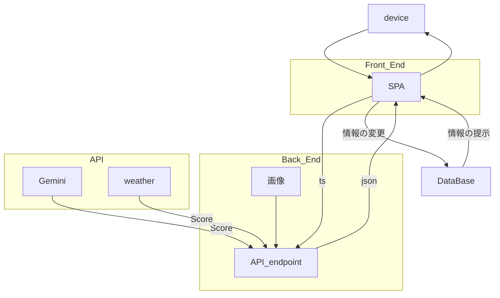

## 4. アプリケーションの概要
-----
### 4-1.機能

### 4-2.使用方法

### 4-3.システムアーキテクチャ図

```mermaid
graph TD
  device --> API_
  API_ --> device
  
  API_ --tsx--> SPA
  SPA --json--> API_
  
  local --> SPA
  
  DataBase --情報の提示--> API_
  API_ --情報の変更--> DataBase
  
  Gemini --Score--> SPA
  weather --Score--> SPA
  
    subgraph Front_End
        API_[SPA]
    end

    subgraph "Back_End"
        SPA[API_endpoint]
        local[画像]
    end

		subgraph "API"
				weather[weather]
				Gemini[Gemini]
		end
```
